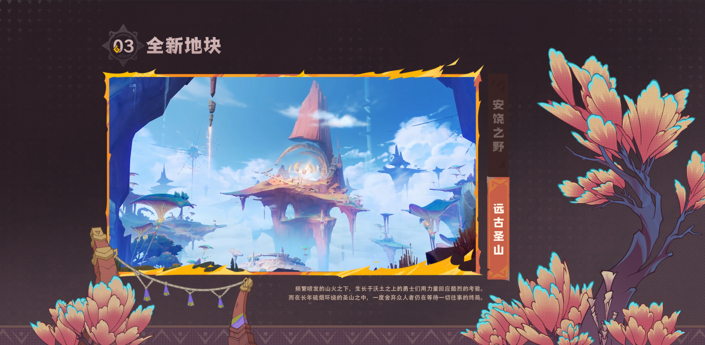
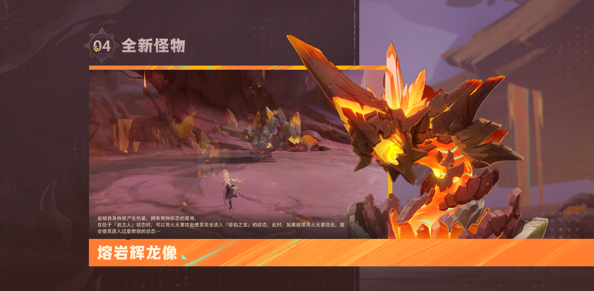
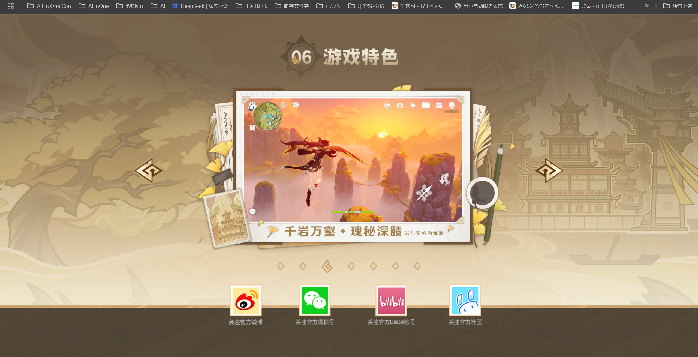

# 复刻原神 5.1 版本先行展示页

## 0. 视频

- [BilBil站视频演示](https://www.bilibili.com/video//)

## 1. 基本信息

- 作者: 啊是特嗷桃
- 系列: 复刻系列
- 官方的网站: [《原神》官方网站-全新5.5版本「众火溯还之日」上线！](https://ys.mihoyo.com/)
- 复刻的网站: [《原神》官方网站-全新5.5版本「众火溯还之日」上线！](https://gmcy2020.github.io/Reprint-GenshinImpact-5.5/)
- 仓库: [GitHub](https://github.com/GMCY2020/Reprint-GenshinImpact-5.5) | [Gitee](https://gitee.com/GMCY2020/Reprint-GenshinImpact-5.5)
- 话题(GitHub): [Vue](https://github.com/topics/vue) \ [Reprint](https://github.com/topics/reprint) \ [MiHoYo](https://github.com/topics/mihoyo) \ [Genshin Impact](https://github.com/topics/genshin-impact)
- 创建时间: 2025/04/01

## 2. 介绍

- 项目以 [《原神》官方网站-全新5.5版本「众火溯还之日」上线！](https://ys.mihoyo.com/) 为参考, 进行粗略的模仿
- 项目视图等资源来自米哈游官方网站, 仅编程学习用
- 绝区零官网官网的样式参考创建时间前的
- 大小适配 大体应该没问题 应该吧
- window11 2560X1440屏幕 缩放150% 谷歌浏览器 是没问题的 其它可能适配有点问题
- 能力有限, 无法做到米家那般丝滑

- .（￣︶￣）↗
 
- `简化版`
- `适配还是有bug, 鸽~, 容我研究一下先`

## 3. 环境

编辑器

- `VSCode`

工具与框架

- `vue3`
- 等

## 4. 效果图

PC端

手机端 鸽~ 
